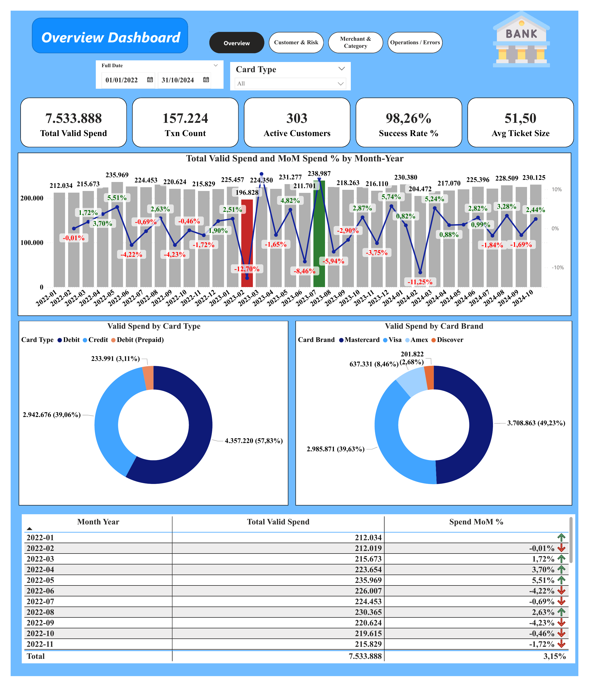

# Xóm Bank — End-to-End Data Analytics & ML Project

**Author:** Nguyên Vũ
**Role:** Data Analyst / Data Engineer
**Stack:** SQL Server · Power BI · Python (scikit-learn, XGBoost, SHAP)

Một dự án dữ liệu hoàn chỉnh trên bộ dữ liệu giao dịch thẻ ngân hàng **Xóm Bank**, đi trọn vòng đời phân tích: từ truy vấn SQL thô → xây Data Warehouse (star schema) → trực quan hóa Power BI → mô hình Machine Learning dự đoán rủi ro.

---

## 1. Project Overview

Trong ngành ngân hàng phát hành thẻ, mỗi giao dịch vừa là nguồn doanh thu (phí interchange), vừa là tín hiệu về hành vi chi tiêu và rủi ro tín dụng. Dự án này được xây dựng nhằm biến **157.224 giao dịch thô** thành thông tin ra quyết định được — trải trên bốn tầng, mỗi tầng giải quyết một câu hỏi kinh doanh khác nhau:

- **Tiền đang chảy vào đâu?** — phân tích doanh số theo thời gian, sản phẩm, ngành hàng
- **Khách hàng nào rủi ro?** — đo lường credit utilization, debt-to-income của danh mục
- **Hệ thống vận hành tốt không?** — giám sát tỷ lệ lỗi giao dịch, phân loại nguyên nhân
- **Có dự đoán được giao dịch lỗi không?** — mô hình ML phát hiện anomaly

## 2. Business Objectives

- Chuẩn hóa logic nghiệp vụ và làm sạch dữ liệu ở tầng SQL
- Xây kho dữ liệu OLAP (Kimball star schema) phục vụ phân tích nhanh và tái sử dụng
- Cung cấp dashboard tương tác cho các bộ phận Risk, Cards Product, Marketing, Operations
- Dự đoán giao dịch lỗi để hỗ trợ đội vận hành ưu tiên rà soát

## 3. Data & Model

**Nguồn:** cơ sở dữ liệu OLTP `BankingDB` — 4 bảng gốc.

| Bảng | Số dòng | Mô tả |
|---|---|---|
| `users` | 2.000 | Khách hàng (tuổi, thu nhập, credit score, nợ) |
| `cards` | 6.146 | Thẻ (brand, type, hạn mức, chip) |
| `transactions` | 157.224 | Giao dịch (2022-01 → 2024-10) |
| `mcc_codes` | 109 | Mã ngành hàng |

**Quy ước quan trọng:**
- JOIN giao dịch với thẻ qua `transactions.card_id = cards.id` (KHÔNG dùng `client_id` — gây fan-out, thổi phồng mọi tổng)
- "Chi tiêu hợp lệ" (*Valid Spend*) = `errors IS NULL AND amount > 0` (loại giao dịch lỗi và refund)
- `errors IS NULL` = thành công (98,26%); giá trị non-null là lý do lỗi

## 4. Kiến trúc dự án (4 giai đoạn)

```
SQL Analysis  →  Data Warehouse  →  Power BI  →  Machine Learning
 (làm sạch)      (star schema)     (dashboard)   (fraud detection)
```

```
xombank-analytics/
├── docs/                     # Kimball dimensional modeling workbook
├── 01_sql_analysis/          # Query gốc + business questions + data quality
├── 02_datawarehouse/         # 7 script ETL (DDL → Stage → Extract → Load → Verify → Index)
├── 03_powerbi/               # Báo cáo phân tích dashboard
└── 04_ml/                    # Fraud detection: src, notebook, model, metrics
```

---

## 5. Kết quả từng giai đoạn

### 5.1 SQL Analysis — Nền tảng
Refactor query gốc: sửa lỗi off-by-one khi phân band credit_score, chuẩn hóa JOIN qua `card_id`, tách từng business question thành query có chú thích. Kiểm tra chất lượng dữ liệu: 0 orphan `card_id`, xác định 16 loại lỗi, phát hiện refund (amount < 0).

📁 [`01_sql_analysis/`](01_sql_analysis/) — `business_questions.sql`, `data_quality.sql`

### 5.2 Data Warehouse — Kimball Star Schema
Xây kho dữ liệu 3 tầng: `BankingDB` (OLTP) → `StagingDB` → `BankingDW`. Star schema gồm **1 fact + 6 dimension + 1 audit dimension**, thiết kế SCD-2 cho Customer/Card, junk dimension cho transaction type, Unknown Member cho mọi dim.

**Pipeline 7 script chạy tuần tự** — DDL → Stage → Extract → Transform/Load dims → Load fact → Verify → Index. Kiểm định đối soát đạt **40/40 PASS, 0 FAIL**:

| Kiểm tra | Kết quả |
|---|---|
| COUNT(FactTransaction) | 157.224 ✓ |
| SUM(Amount) | 6.874.483,49 ✓ |
| Total Valid Spend | 7.533.887,55 ✓ |
| Orphan keys / Duplicate BK | 0 ✓ |

📁 [`02_datawarehouse/`](02_datawarehouse/) — 7 script SQL + [`dw_design.md`](02_datawarehouse/dw_design.md)

### 5.3 Power BI — Dashboard & Báo cáo
Bốn trang dashboard trên star schema: **Executive Overview · Customer & Risk · Merchant & Category · Operations**, kèm báo cáo phân tích và khuyến nghị hành động cho từng bộ phận.



**Phát hiện chính:** Debit áp đảo Credit (57,8% vs 39,1%) → dư địa tăng doanh thu interchange; danh mục rủi ro thấp (utilization 12,8%) nhưng hạn mức nhóm điểm cao bị dùng dưới tiềm năng; 98,26% giao dịch thành công, lỗi chủ yếu do khách hàng (Insufficient Balance, Bad PIN) chứ không phải hệ thống.

> 📄 **[Đọc báo cáo phân tích Power BI đầy đủ](03_powerbi/doc/Banking_Analysis_Report.docx)**  
> Báo cáo trình bày KPI, insight và khuyến nghị hành động cho từng nhóm stakeholder: Management, Risk, Cards Product/Marketing và Operations.

### 5.4 Machine Learning — Fraud / Error Detection
Mô hình phân loại nhị phân **mất cân bằng (1,74%)** dự đoán giao dịch lỗi. Đọc feature từ DW, bổ sung timestamp từ OLTP (giờ giao dịch, velocity). Chống leakage nghiêm ngặt: time-based split, SMOTE chỉ trên train, loại target khỏi feature.

| Model | PR-AUC | ROC-AUC |
|---|---|---|
| Dummy (baseline) | 0,018 | 0,507 |
| Logistic Regression | 0,028 | 0,634 |
| **XGBoost** | **0,056** | **0,683** |

**Recall@k thực dụng:** review top 10% giao dịch rủi ro nhất → bắt được ~32% tổng số lỗi. Top feature (SHAP): `amount`, `yearly_income`, `merchant_freq`, `velocity`, `txn_hour`.

📁 [`04_ml/`](04_ml/) — [README chi tiết](04_ml/README.md) · `src/` · `notebooks/` · `models/`

---

## 6. Tổng kết

Dự án minh họa một pipeline dữ liệu hoàn chỉnh, mỗi tầng đều tái sử dụng thành quả của tầng trước: SQL làm sạch nghiệp vụ → DW đóng gói thành semantic layer → Power BI khai thác cho business user → ML dùng chính feature ấy để dự đoán. Điểm nhấn xuyên suốt là **tính đúng đắn của dữ liệu** (JOIN đúng khóa, đối soát 40/40, chống leakage) — nền tảng để mọi con số và mô hình phía sau đáng tin cậy.
